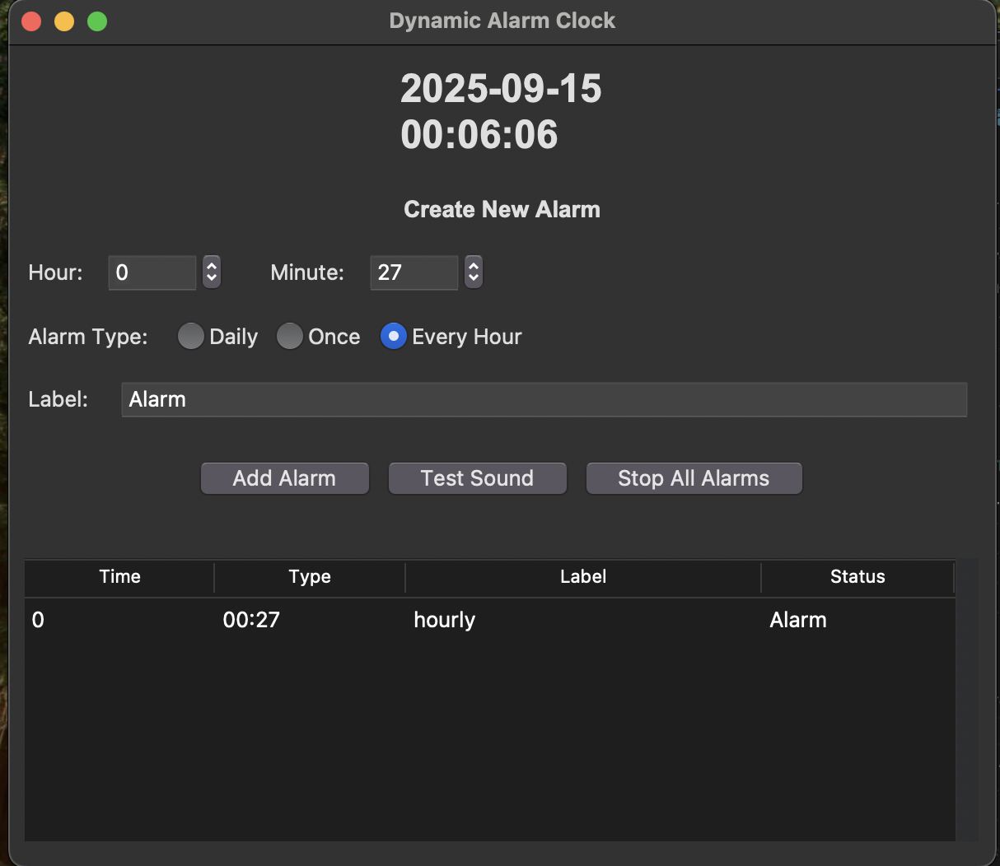

# Jess-Alarm-System

Jess-Alarm-System is a Python-based alarm application designed to help users set, manage, and trigger alarms with a simple interface. The system allows you to schedule alarms, customize alarm sounds, and receive notifications when alarms go off.

## Main Screen

Below is a sample screenshot of the main screen. The interface displays a list of scheduled alarms, options to add or delete alarms, and controls to customize alarm settings such as time, label, and sound.

The main screen provides:
- A list of upcoming alarms with their scheduled times and labels.
- Buttons to add, edit, or delete alarms.
- Controls to set custom alarm sounds and notification preferences.
- Visual indicators for active and inactive alarms.

